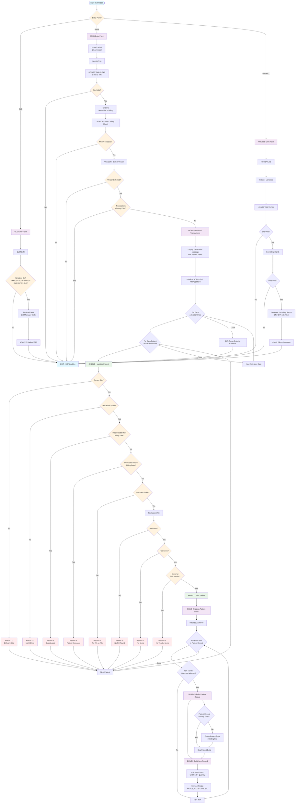

```mermaid
flowchart TD
    Start([Start RMPOBIL0]) --> Entry{Entry Point?}
    
    %% Entry Point Decision
    Entry -->|OLD| OLD[OLD Entry Point]
    Entry -->|MAIN| MAIN[MAIN Entry Point]
    Entry -->|PREBILL| PREBILL[PREBILL Entry Point]
    
    %% OLD Entry Point Flow
    OLD --> CallMain[Call MAIN]
    CallMain --> CheckVars{Variables Set?<br/>RMPODATE, RMPOVDR<br/>RMPOXITE, QUIT}
    CheckVars -->|No| Exit[EXIT - Kill Variables]
    CheckVars -->|Yes| ListMgr[EN^RMPOLM<br/>List Manager Code]
    ListMgr --> Accept[ACCEPT^RMPOPST3]
    Accept --> Exit
    
    %% MAIN Entry Point Flow
    MAIN --> HomeZIS[HOME^%ZIS<br/>Clear Screen]
    HomeZIS --> InitQuit[Set QUIT=0]
    InitQuit --> GetSite[HOSITE^RMPOUTL0<br/>Get Site Info]
    GetSite --> SiteCheck{Site Valid?}
    SiteCheck -->|No| Exit
    SiteCheck -->|Yes| CKSite[CKSITE<br/>Setup Site in Billing]
    
    CKSite --> GetMonth[MONTH - Select Billing Month]
    GetMonth --> MonthCheck{Month Selected?}
    MonthCheck -->|No| Exit
    MonthCheck -->|Yes| GetVendor[VENDOR - Select Vendor]
    
    GetVendor --> VendorCheck{Vendor Selected?}
    VendorCheck -->|No| Exit
    VendorCheck -->|Yes| CheckExisting{Transactions<br/>Already Exist?}
    CheckExisting -->|Yes| Exit
    CheckExisting -->|No| Gen1[GEN1 - Generate Transactions]
    
    %% GEN1 Processing Flow
    Gen1 --> DisplayMsg[Display Generation Message<br/>with Vendor Name]
    DisplayMsg --> InitLoop[Initialize: ACTIVDT=0, RMPODFN=0]
    InitLoop --> ActivLoop{For Each<br/>Activation Date}
    
    ActivLoop --> PatientLoop{For Each Patient<br/>in Activation Date}
    PatientLoop --> CheckOK2BLD[OK2BLD - Validate Patient]
    
    %% OK2BLD Validation Decision Tree
    CheckOK2BLD --> ValidSite{Correct Site?}
    ValidSite -->|No| Return1[Return -1:<br/>Different Site]
    ValidSite -->|Yes| HasBoiler{Has Boiler Plate?}
    
    HasBoiler -->|No| Return2[Return -2:<br/>No HO Info]
    HasBoiler -->|Yes| CheckInactive{Inactivated Before<br/>Billing Date?}
    
    CheckInactive -->|Yes| Return3[Return -3:<br/>Deactivated]
    CheckInactive -->|No| CheckDeceased{Deceased Before<br/>Billing Date?}
    
    CheckDeceased -->|Yes| Return9[Return -9:<br/>Patient Deceased]
    CheckDeceased -->|No| HasRx{Has Prescription?}
    
    HasRx -->|No| Return4[Return -4:<br/>No RX on File]
    HasRx -->|Yes| FindRx[Find Latest RX]
    FindRx --> RxFound{RX Found?}
    
    RxFound -->|No| Return5[Return -5:<br/>No RX Found]
    RxFound -->|Yes| HasItems{Has Items?}
    
    HasItems -->|No| Return7[Return -7:<br/>No Items]
    HasItems -->|Yes| VendorItems{Items for<br/>This Vendor?}
    
    VendorItems -->|No| Return8[Return -8:<br/>No Vendor Items]
    VendorItems -->|Yes| ValidPatient[Return 1: Valid Patient]
    
    %% Continue with Valid Patients
    ValidPatient --> Gen2[GEN2 - Process Patient Items]
    
    %% GEN2 Processing
    Gen2 --> InitItems[Initialize ZXITM=0]
    InitItems --> ItemLoop{For Each Item<br/>in Patient Record}
    ItemLoop --> CheckVendorMatch{Item Vendor<br/>Matches Selected?}
    CheckVendorMatch -->|No| NextItem[Next Item]
    CheckVendorMatch -->|Yes| BuildPatient[BUILDP - Build Patient Record]
    
    BuildPatient --> BuildItem[BUILDI - Build Item Record]
    BuildItem --> CalcCosts[Calculate Costs<br/>Unit Cost × Quantity]
    CalcCosts --> SetFields[Set Item Fields:<br/>HCPCS, ICD-9, Costs, etc.]
    SetFields --> NextItem
    
    NextItem --> ItemLoop
    ItemLoop -->|Done| NextPatient[Next Patient]
    NextPatient --> PatientLoop
    PatientLoop -->|Done| NextActivation[Next Activation Date]
    NextActivation --> ActivLoop
    ActivLoop -->|Done| UserPrompt[DIR: Press Enter to Continue]
    UserPrompt --> Exit
    
    %% PREBILL Flow
    PREBILL --> PreHome[HOME^%ZIS]
    PreHome --> PreInit[Initialize Variables]
    PreInit --> PreSite[HOSITE^RMPOUTL0]
    PreSite --> PreSiteCheck{Site Valid?}
    PreSiteCheck -->|No| Exit
    PreSiteCheck -->|Yes| PreDate[Get Billing Month]
    PreDate --> PreDateCheck{Date Valid?}
    PreDateCheck -->|No| Exit
    PreDateCheck -->|Yes| PreReport[Generate Pre-billing Report<br/>EN1^DIP with Filter]
    PreReport --> PreEnd[Check if Print Complete]
    PreEnd --> Exit
    
    %% Build Helper Routines
    BuildPatient --> CheckPExists{Patient Record<br/>Already Exists?}
    CheckPExists -->|Yes| SkipBuildP[Skip Patient Build]
    CheckPExists -->|No| CreatePatient[Create Patient Entry<br/>in Billing File]
    CreatePatient --> SkipBuildP
    SkipBuildP --> BuildItem
    
    %% Error Returns Flow Back
    Return1 --> NextPatient
    Return2 --> NextPatient  
    Return3 --> NextPatient
    Return4 --> NextPatient
    Return5 --> NextPatient
    Return7 --> NextPatient
    Return8 --> NextPatient
    Return9 --> NextPatient
    
    %% Styling
    classDef startEnd fill:#e1f5fe
    classDef process fill:#f3e5f5
    classDef decision fill:#fff3e0
    classDef error fill:#ffebee
    classDef validation fill:#e8f5e8
    
    class Start,Exit startEnd
    class MAIN,OLD,PREBILL,Gen1,Gen2,BuildPatient,BuildItem process
    class Entry,CheckVars,SiteCheck,MonthCheck,VendorCheck,CheckExisting decision
    class ValidSite,HasBoiler,CheckInactive,CheckDeceased,HasRx,RxFound,HasItems,VendorItems decision
    class Return1,Return2,Return3,Return4,Return5,Return7,Return8,Return9 error
    class CheckOK2BLD,ValidPatient validation
```
